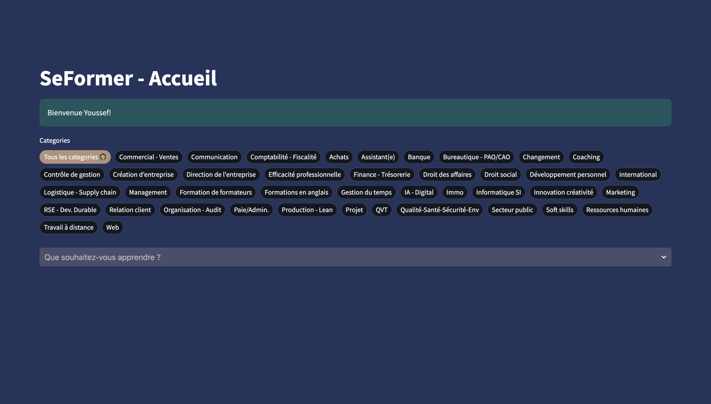
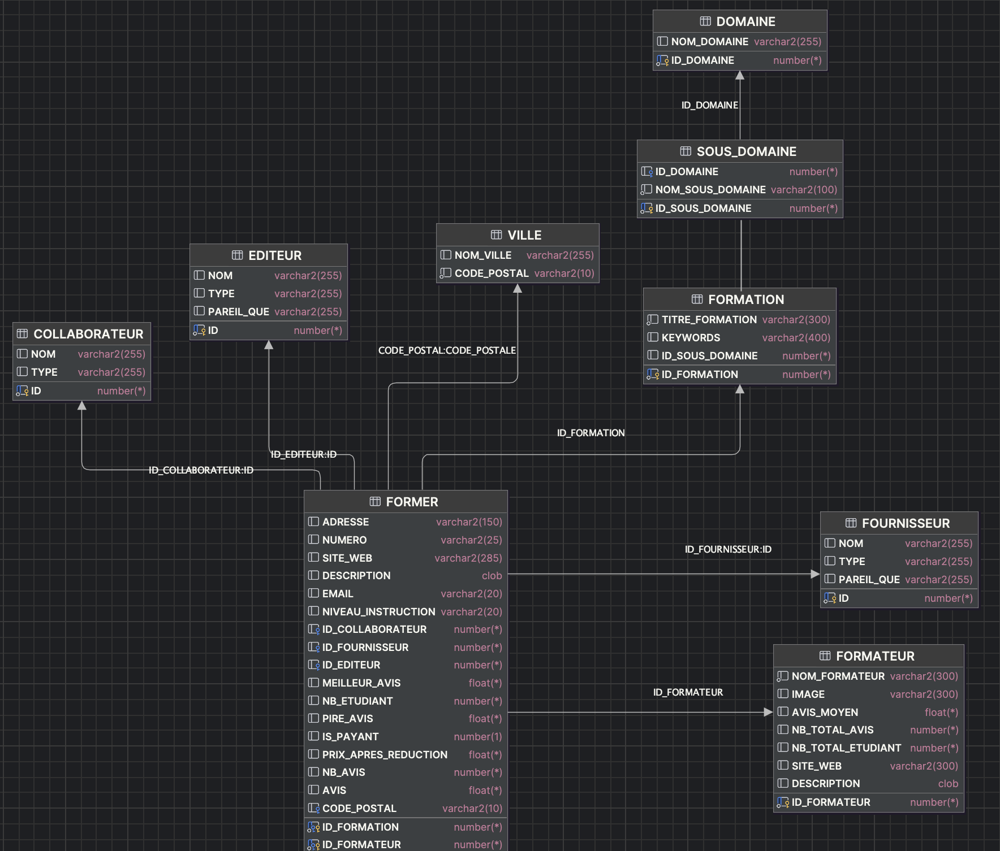
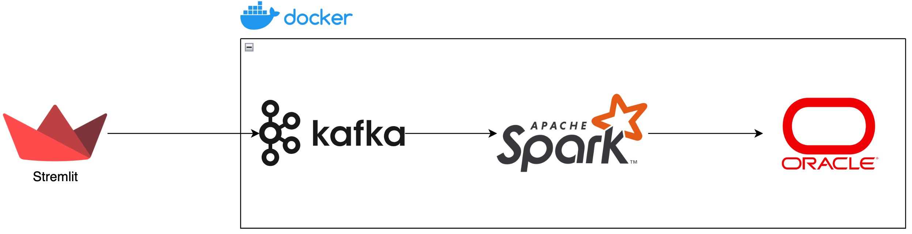

# Real-Time CourseCompass

 


## Introduction

This Smart Learning Platform aims to revolutionize course discovery by aggregating learning resources from various providers, enhancing search capabilities with AI-powered keywords, and providing real-time course recommendations. Built with scalability in mind, the platform serves as a bridge between learners and educational content providers.

**Key Technologies & Choices**:
- **Oracle XE Database**: Chosen due to academic requirements and professor's recommendation for relational database management
- **Streamlit**: Rapid web interface development for Python-based data applications
- **Gemini Flash 1.5**: For efficient keyword generation and natural language processing
- **Spark MLlib & Kafka**: Real-time processing and scalable machine learning pipelines
- **Docker**: Containerization for portable and reproducible environments
- **Selenuim**: Webscraping !


## Project Architecture

### Phase 1: Data Enrichment Pipeline
**Goal**: Match courses with instructors/organizations
- Processed initial dataset (courses.csv) containing:
  - Course ID, Category, Subcategory, Title
- Developed matching algorithm to associate courses with providers:
  - Web scraping (e.g., Coursera, Google Maps)
  - Manual verification for data accuracy
- Output: Enriched dataset with provider information

### Phase 2: Database Integration & Web Interface
**Components**:
1. **Oracle XE Database**:
   - Designed using UML relational model
   - Tables: Courses, Providers, Categories, Keywords, Users
   - Implemented data quality checks:
     - Null value validation
     - Category consistency checks
     - Provider verification

2. **AI-Powered Search**:
   - Integrated Gemini Flash 1.5 for keyword generation
   - Search features:
     - Category filtering
     - Keyword-based search
     - Provider-based filtering

3. **Streamlit Interface**:
   - Course browsing dashboard
   - Advanced search functionality
   - Admin panel for data management

 <!-- Normalized -->

### Phase 3: Real-time Recommendation System
**Scalable Architecture**:
- **Content-Based Filtering**:
  - Cosine similarity for course recommendations
  - TF-IDF vectorization using Spark MLlib
- **Real-Time Pipeline**:
  - Kafka for streaming user interactions
  - Spark Streaming for real-time processing
  - Dockerized the architecture


  
## Run the project 
The project architecture :
```bash
├── Application
│   ├── app.py
│   ├── models.py
│   └── tools.py
├── Data
│   ├── CSVs
│   │   └── *.csv # all CSVs 
│   └── DDL
│       └── *.sql # all tables DDL
├── Scripts
│   ├── Data Insertion
│   │   ├── data_aliementation.ipynb
│   │   ├── power_database.py
│   │   └── power_database2.py
│   ├── Data Transformation
│   │   ├── Data_transformation.ipynb
│   │   └── Data_transformation_2.ipynb
│   ├── Scraping
│   │   ├── GoogleMaps_scraping.ipynb
│   │   └── web_scraper_coursera.py
│   ├── Test scripts
│   │   ├── test-kafka.py
│   │   └── test-spark.py
│   └── quality_augmentation.py # generating the keywords and data quality
└── config
    ├── Dockerfile
    ├── docker-compose.yml
    ├── notebooks
    ├── oracle
    │   └── instantclient-basic-linux.x64-23.7.0.25.01.zip
    ├── spark_scripts
    │   ├── consumer.py
    │   ├── courses.csv
    │   ├── model_studio.ipynb
    │   └── note.txt
    └── startup.sh # launched on spark master ! to start the jupyter lab
```
### Setup

1. **Clone Repository**
   ```bash
   git clone https://github.com/yChaaby/Smart-Learning-Platfome.git
   cd Smart-Learning-Platfome```
2. Ensure Oracle XE is running
Update database credentials in connection function: <code>./Application/tools.py</code>

```python
def connect_to_oracle():
    try:
        #locate the odbc
        cx_Oracle.init_oracle_client(lib_dir="/Users/youssefchaabi/instantclient_19_16")
    except:
        print("An exception occurred")
    # Remplace les valeurs ci-dessous par tes propres paramètres de connexion
    dsn = cx_Oracle.makedsn("localhost", "1521", service_name="XEPDB1")
    conn = cx_Oracle.connect(user="your_user", password="your_password", dsn=dsn)
    return conn
```


3.Start the Big Data Services
```bash
cd config
docker-compose up -d --build
./kafka-topics.sh --bootstrap-server localhost:9092 --create --topic interaction # on kafka node
/startup.sh  # Run on Spark master node
spark-submit --packages org.apache.spark:spark-sql-kafka-0-10_2.12:3.5.0 consumer.py # run the spark streming consumer on master node !
```
4. Launch Application
```bash
streamlit run Application/app.py
```
Access Points 

Web UI: http://localhost:8501

Spark Master: http://localhost:8080

Kafka Server: http://localhost:9094

Oracle Server: http://localhost:1521
### ⚠️ Important Notes

Allow 2-3 minutes for containers to initialize

Ensure port conflicts don't occur (8501/8080/9000)

Oracle credentials must match your database instance

Make sure that Docker, Streamlit, OracleODBC and GeminiAPI are installed

## 🎯 Conclusion & Acknowledgments

This project demonstrates a complete pipeline for educational resource aggregation and intelligent recommendation, combining:
- AI-enhanced data enrichment (Gemini keywords)
- Enterprise-grade database management (Oracle XE)
- Modern big data processing (Spark/Kafka)

Special thanks to our valuable contributors:
- **[BOUFALA Lamia](https://github.com/lamiaboufala)** 
- **[HEMMATI Yasaman](https://github.com/YSMN-HMT)** 

🙏 Your contributions were essential in establishing the project's foundation!

---


